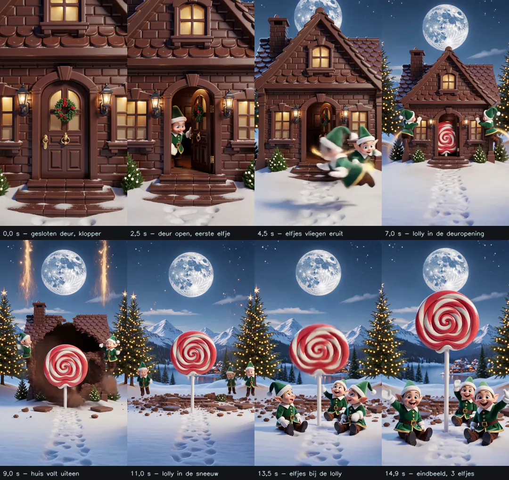

# Kerstkaart

> Ingevuld op 4 oktober 2026 op basis van de aanlevering van de eigenaar en bijgewerkt op 4 oktober 2026 met wat in `Vaylide-Chocoladehuis-Elfjes-preview.mp4` is aangetroffen. Wat niet is aangeleverd staat als "nog niet bepaald"; er is niets bijverzonnen.

## 1. Naam

Kerstkaart

## 2. Slug

`kerstkaart`

## 3. Categorie

Kerst

## 4. Status

**Gebouwd, lokaal** (4 oktober 2026): Kerstkaart is als VAYLIDE-kaart gebouwd in `designs/kerstkaart/v1/` op de lokale werkbranch `claude/kerstkaart` (vanaf `8c429a7`). Hij is een **Special** (categorie Kerst, groep A van de collectie, sort_order 8). De **prijs voor `special-kerstkaart` is nog niet bepaald**: zonder die optie in Beheer, Prijzen kost de kaart gewoon de prijs van het gekozen pakket en is hij dus bestelbaar (de bestaande Special-terugval). Nog niet gecommit, niet gepusht, niet op staging, niet current/live.

**Besluit van de eigenaar (4 oktober 2026): geen nieuwe Higgsfield-generaties.** De bestaande video `Vaylide-Chocoladehuis-Elfjes-preview.mp4` is goed genoeg en is de definitieve videobasis. Er is dus geen eindbeeld F, geen nieuwe Shot 1 en geen nieuwe Shot 2 gemaakt en er zijn geen Higgsfield-credits gebruikt. Bewust aanvaard, en geen blockers meer: er zijn 3 elfjes zichtbaar in de video; het huis wordt niet letterlijk door zichtbare happen opgegeten (het lost op en valt uiteen); de lolly springt maar kort; de camera zoomt aan het eind in.

## 5. Concept / verhaal

Een sprookjesachtige kerstwereld met:

- sneeuw;
- kerstbomen;
- een mooie maan;
- een huis volledig van chocolade.

De kijker moet niet alleen kijken maar de opening zelf starten door op de voordeur te kloppen.

## 6. Opening / animatie

Definitieve verhaallijn:

1. De kijker ziet het chocoladehuis in de besneeuwde kerstwereld.
2. Op de voordeur zit een duidelijke gouden deurklopper.
3. Bij de deur staat subtiel: "Tik op de deurklopper".
4. De kijker klikt/tikt op de deurklopper.
5. Er wordt zichtbaar/auditief-beeldmatig aangeklopt.
6. De voordeur gaat open.
7. 4–5 groene elfjes vliegen naar buiten.
8. De elfjes vliegen naar het chocoladehuis en eten het huis beeldmatig op.
9. Uiteindelijk blijft alleen een rood-witte lolly / zuurstokachtige snoeplolly over.
10. De lolly springt naar voren.
11. De elfjes gaan naast de lolly staan.
12. De elfjes zwaaien naar de kijker.
13. De camera zoomt uit zodat de volledige kerstwereld weer zichtbaar wordt.

Sneeuw, kerstbomen en maan moeten gedurende de scène als wereld behouden blijven.

**Wat de bestaande Higgsfield-video daarvan laat zien** (steekproef van één beeld per seconde, 4 oktober 2026; het geluid is niet beluisterd):

| Moment | Wat er te zien is |
|---|---|
| 0 tot ±2 s | Close-up van de gesloten chocoladevoordeur met een **gouden deurklopper (ring)** en een gouden handgreep, een kerstkrans, lantaarns, verlichte ramen en sneeuw voor de trap. |
| ±2 tot 3 s | De deur gaat open; een groen elfje (pak en muts) kijkt/zwaait vanuit de deuropening. |
| ±3 tot 7 s | Meerdere groene elfjes vliegen naar buiten (met bewegingsonscherpte en gouden sporen); de camera begint uit te zoomen; de maan (vanaf ±4 s), kerstbomen en het sneeuwlandschap komen in beeld. |
| ±7 tot 8 s | Een rood-witte lolly is zichtbaar in de deuropening. |
| ±8 tot 10 s | Het huis valt uiteen en lost op met gouden vonken; stukken chocolade liggen in de sneeuw; bergen, dorp en water op de achtergrond. |
| ±10 tot 15 s | De lolly op een stok staat in de sneeuw en komt groter in beeld; elfjes bij de resten, daarna zittend en zwaaiend naast de lolly. Het eindbeeld toont **3 elfjes**. |

Verschillen met de definitieve verhaallijn (alleen vastgesteld uit de steekproef): er is in de beelden geen duidelijk kloppen te zien (de deur gaat open); het huis lost op met vonken in plaats van dat de elfjes het zichtbaar opeten; de lolly lijkt te rijzen en groter te worden in plaats van naar voren te springen; het eindbeeld heeft 3 in plaats van 4–5 elfjes. Of er een klopgeluid in het audiospoor zit: niet onderzocht.

**Aanvullende waarnemingen uit de dichte analyse van de referentievideo** (beelden per 0,25 tot 0,5 s, geluid per halve seconde, 4 oktober 2026; alleen feiten, geen besluiten):

- 0 tot 1,75 s: het beeld staat bijna stil (gesloten deur met kerstkrans, lantaarns en verlichte ramen). De **gouden deurklopper** zit midden op de deur, ongeveer op 54 % van de breedte en 61 % van de hoogte van het beeld; links ervan zit een gouden handgreep. Er beweegt niets aan de klopper: geen klopbeweging.
- 1,75 tot 2,25 s: de deur zwaait open (scharnier links); vanaf 2,25 s verschijnt een elfje in de opening. De camera begint dan langzaam uit te zoomen en is rond 6 s in een brede stand (maan, bomen met lichtjes, bergen).
- 3 tot 6,5 s: er zijn gelijktijdig hooguit 2 à 3 elfjes zichtbaar (met bewegingsonscherpte en gouden sporen); ze vliegen om en langs het huis.
- 6,5 tot 7 s: een rood-witte lolly verschijnt in de deuropening, vóór het huis wordt aangetast. Vanaf 7,25 s staan er donkere **happen** (gaten) in de muren naast de deur; 8,5 tot 9,5 s breekt het huis open en valt uiteen, met stukken chocolade en opstijgende gouden vonken. Er is geen beeld waarin een elf zichtbaar in de chocolade bijt.
- 10 tot 12,5 s: de lolly staat op een stok midden in de sneeuw; de elfjes (3) staan eerst klein op de achtergrond en rennen/springen naar voren.
- 13 tot 13,5 s: de lolly beweegt kort omhoog en omlaag (onscherp, een klein sprongetje), daarna komt hij groter in beeld: de camera **zoomt aan het eind juist in** (de lolly en de 3 elfjes worden groter), niet uit. Het eindbeeld (14 tot 15 s) is een halve close-up met 3 zittende, zwaaiende elfjes.
- Geluid: het audiospoor bevat geluid met weinig energie tot 2 s (waaronder bij ±0,5 en ±1,5 s iets zachts), en duidelijk meer energie van 7 tot 10,5 s (piek ±9,5 s, passend bij het afbrokkelen van het huis). Welk geluid het precies is, is niet beluisterd.

## 7. Pagina na de opening

De opening, de kop en het begin van de kaart zijn één scène (`.kk-hero`) met een eigen script (`kerstkaart.js`); er is geen openingsscherm van `invite.js`. De kaart eronder heeft een eigen identiteit en kopieert Kerstbol niet:

- **Wereld:** nachtblauw met sneeuw, chocoladebruin, rood-wit snoep, warm kerstlicht en de maan als terugkerend element (in het raam van de brief, in de afsluiting).
- **Banden:** een sneeuwrand (witte sneeuwlaag) tussen de video en de eerste lichte band; de brief in een gewelfd, warm verlicht raam van het chocoladehuis met een foto in een maan; Ons jaar op een nachtlucht; Momenten als chocoladetabletten met een hoekje goudfolie; een snoepstok als scheiding; de datum op een lolly (uitsnede uit de video, draait langzaam) met een stilstaand cijfer; het programma als tabletten langs een snoepstok; aftellen als pepermuntjes; aanmelden op een kaart met een snoeprand; locatie en afsluiting op nachtbeelden uit dezelfde video.
- **Typografie:** Fraunces voor koppen (zacht, warm), Nunito voor tekst.
- **Inhoud:** alleen wat de klant heeft ingevuld (studiovelden zijn leidend; prototypeteksten zijn alleen een terugval). Datum, programma, locatie, aftellen en aanmelden verschijnen alleen bij een kerstdiner (een datum).

**Opening, technisch:** het startbeeld is het eerste videobeeld zonder klopper; de gouden klopper is een uitsnede uit datzelfde beeld in twee delen (plaat en ring) die pixel voor pixel op hun plek staan, zodat de ring los kan bewegen en de overgang naar de video naadloos is. Een tik op de klopper geeft drie klopjes (de ring wordt omhoog getild en valt terug, een lichtflits in het raam, gouden vonken, een zacht gesynthetiseerd klopgeluid zonder geluidsbestand), daarna start de video. De video start nooit vanzelf. Daarnaast: Opening overslaan, Opnieuw beleven, minder beweging (direct het eindbeeld met een knop "Speel de opening af"), geblokkeerde autoplay (knop), sessie-onthouden, scroll-vergrendeling tijdens de opening. Op een breed scherm staat de verticale video volledig over de volle hoogte met dynamische zijgloed (niet croppen).

## 8. Assets en waar ze staan

**In de repository (lichte referenties, geen definitieve product-assets), `tools/design-references/kerstkaart/`:**

| Pad | Wat | Grootte |
|---|---|---|
| `tools/design-references/kerstkaart/chocoladehuis-reference.mp4` | referentiekopie van de preview: 540 × 960, 24 fps, 15,04 s, H.264 met audio (AAC) | 2 712 219 bytes |
| `tools/design-references/kerstkaart/storyboard.webp` | contactsheet van 8 momenten (0, 2,5, 4,5, 7, 9, 11, 13,5 en 14,9 s) met bijschriften | 164 786 bytes |
| `tools/design-references/kerstkaart/README.md` | herkomst en afspraken | |

**Lokale masterbron van de eigenaar (niet in Git, ongewijzigd):**

| Asset | Gevonden? | Locatie | Specificaties / opmerking |
|---|---|---|---|
| `Vaylide-Chocoladehuis-Elfjes-preview.mp4` | ja, lokaal | `C:\Users\j-rui\Downloads\Vaylide-Chocoladehuis-Elfjes-preview.mp4` | 33 486 589 bytes (≈32 MB), **1080 × 1920** (9:16), **24 fps**, **361 beelden = 15,04 s**, codec **H.264** (`avc1`), met een **audiospoor** (`mp4a`, AAC stereo 44,1 kHz; inhoud niet beluisterd). Bitrate ruim 17 Mbit/s. De identieke kopie "(1)" in dezelfde map hoeft niet bewaard of verwerkt te worden. |
| `Vaylide-Chocoladehuis-opening.html` | nee | asset nog aan te leveren / locatie onbekend | Nergens in de gebruikersmappen of de repository gevonden. Niet opnieuw gemaakt. |

De referentiekopie in de repository is afgeleid van het origineel (verkleind, volledige duur, beeldverhouding en audio behouden); het origineel is niet overschreven of gewijzigd. Een definitief ontwerp (`designs/kerstkaart/v1/`) bestaat niet.

## 9. Externe AI/video-output

Er is met Higgsfield al één video gemaakt (`Vaylide-Chocoladehuis-Elfjes-preview.mp4`; specificaties in onderdeel 8; lichte referentie en storyboard in `tools/design-references/kerstkaart/`). In die video:

- de deur opent;
- de camera zoomt uit;
- de lolly verschijnt;
- maar het eindbeeld toont slechts 3 elfjes.

Gewenst blijft 4–5 elfjes. De gebruikte prompt en instellingen zijn niet aangeleverd: nog niet bepaald.

**Is de video praktisch bruikbaar als basis voor een interactieve VAYLIDE-opening?** Als referentie en als technisch uitgangspunt: ja. Als definitieve asset: nee, niet zoals hij is.

- Voor: staand formaat (9:16) en 24 fps, H.264 (speelt in elke browser); de eerste seconde toont het gesloten huis met de gouden deurklopper, dus die eerste beeld kan als startposter dienen en geeft de plek van het klikpunt aan; de volgorde deur open → elfjes eruit → camera uit → lolly komt overeen met de verhaallijn.
- Tegen: 33 MB is veel te zwaar voor een uitnodiging (verkleinen is nodig; de Balzaal-dansvideo van 5 s is 1,2 MB op 720 × 1280); 15 s is lang; het audiospoor moet bewust worden gekozen (de VAYLIDE-openingen zijn stil); geen duidelijk kloppen; huis lost op i.p.v. opgegeten te worden; lolly springt niet duidelijk naar voren; slechts 3 elfjes in het eindbeeld. Voor 4–5 elfjes en een klopmoment is waarschijnlijk een aangepaste of nieuwe video nodig, en dat vraagt eerst overleg met de eigenaar (credits).

## 10. Technische bouwinstructies

Nog niet definitief bepaald. Wel belangrijk:

- interactie begint bij klik/tik op de gouden deurklopper;
- video/opening moet daarna logisch overgaan in de VAYLIDE-kaart;
- geen automatische start zonder interactie;
- mobiel moet de deurklopper duidelijk aanklikbaar zijn;
- de bestaande video kan als basis/referentie gebruikt worden, niet automatisch als definitieve asset.

## 11. Wat al afgerond is

- concept;
- scène;
- interactie met voordeur;
- elfjes-verhaal;
- lolly-eindmoment;
- één Higgsfield-preview;
- HTML-preview geprobeerd;
- gouden deurklopper als gekozen klikpunt.

## 12. Wat nog moet gebeuren

- [ ] originele HTML-preview terugvinden (de mp4 is gevonden, `Vaylide-Chocoladehuis-opening.html` niet);
- [ ] controleren waarom de HTML-preview eerder niet opende;
- [x] klopmoment toegevoegd in de webopening (drie klopjes); 4–5 elfjes vervallen: bewust 3 aanvaard;
- [x] de video verkleinen/geschikt maken voor het web (720 x 1280, zonder geluid, 2,4 MB);
- [x] volledige VAYLIDE-integratie (lokaal);
- [x] pagina na de opening ontwerpen;
- [ ] responsive/motion/performance later testen.

## 13. Besluiten die niet opnieuw ter discussie hoeven

- de gebruiker klopt zelf op de voordeur;
- de gouden deurklopper is het klikpunt;
- de tekst is "Tik op de deurklopper";
- de deur gaat daarna open;
- groene elfjes (de bestaande video toont er 3; bewust aanvaard);
- de elfjes eten het chocoladehuis (in de video lost het huis op; bewust aanvaard);
- een rood-witte lolly blijft over;
- de lolly springt naar voren;
- de elfjes eindigen naast de lolly en zwaaien;
- de camera zoomt uit (in de bestaande video zoomt hij aan het eind in; bewust aanvaard);
- sneeuw, kerstbomen en maan blijven onderdeel van de wereld;
- **geen nieuwe Higgsfield-generaties:** de bestaande video is de definitieve videobasis (4 oktober 2026);
- de pagina na de opening houdt een eigen Chocoladehuis-identiteit en kopieert Kerstbol niet.

## 14. Laatste relevante commit

Nog niet gecommit. De bouw staat lokaal op `claude/kerstkaart` (vanaf `8c429a7`); niet gepusht.

## 15. Volgende stap

De eigenaar beoordeelt de lokale voorvertoning, bepaalt de prijs voor `special-kerstkaart` (Beheer, Prijzen) en geeft aan wanneer er gecommit en naar de remote gepusht mag worden. Tot die tijd: niet committen, niet pushen, niet deployen, niet current maken. Let op bij het samenvoegen met Kerstbol: beide branches passen `catalog/collectie.py`, `tests/test_collectie.py` en `tests/test_effects.py` aan (tellingen 12/26/9 en 47 worden dan 13/26/9 en 48).
